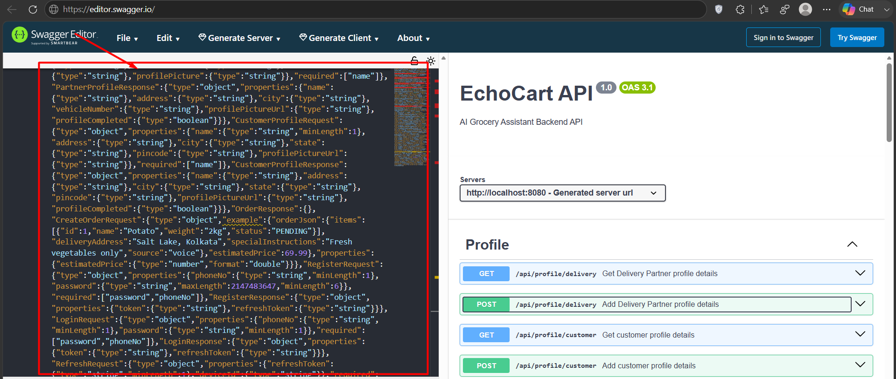

### DOCS FOR THE PROJECT:

Copy this:

``{"openapi":"3.1.0","info":{"title":"EchoCart API","description":"AI Grocery Assistant Backend API","version":"1.0"},"servers":[{"url":"http://localhost:8080","description":"Generated server url"}],"paths":{"/api/profile/delivery":{"get":{"tags":["Profile"],"summary":"Get Delivery Partner profile details","operationId":"getDelivery","parameters":[{"name":"token","in":"header","required":true}],"responses":{"200":{"description":"OK","content":{"*/*":{"schema":{"$ref":"#/components/schemas/PartnerProfileResponse"}}}}}},"post":{"tags":["Profile"],"summary":"Add Delivery Partner profile details","operationId":"setDelivery","parameters":[{"name":"token","in":"header","required":true}],"requestBody":{"content":{"application/json":{"schema":{"$ref":"#/components/schemas/PartnerProfileRequest"}}},"required":true},"responses":{"200":{"description":"OK","content":{"*/*":{"schema":{"$ref":"#/components/schemas/PartnerProfileResponse"}}}}}}},"/api/profile/customer":{"get":{"tags":["Profile"],"summary":"Get customer profile details","operationId":"getUser","parameters":[{"name":"token","in":"header","required":true}],"responses":{"200":{"description":"OK","content":{"*/*":{"schema":{"$ref":"#/components/schemas/CustomerProfileResponse"}}}}}},"post":{"tags":["Profile"],"summary":"Add customer profile details","operationId":"setUser","parameters":[{"name":"token","in":"header","required":true}],"requestBody":{"content":{"application/json":{"schema":{"$ref":"#/components/schemas/CustomerProfileRequest"}}},"required":true},"responses":{"200":{"description":"OK","content":{"*/*":{"schema":{"$ref":"#/components/schemas/CustomerProfileResponse"}}}}}}},"/api/orders/{orderId}/pickup":{"post":{"tags":["Orders"],"operationId":"pickupOrder","parameters":[{"name":"orderId","in":"path","required":true,"schema":{"type":"string","format":"uuid"}}],"responses":{"200":{"description":"OK","content":{}}}}},"/api/orders/{orderId}/deliver":{"post":{"tags":["Orders"],"operationId":"deliverOrder","parameters":[{"name":"orderId","in":"path","required":true,"schema":{"type":"string","format":"uuid"}}],"responses":{"200":{"description":"OK","content":{"*/*":{"schema":{"$ref":"#/components/schemas/OrderResponse"}}}}}}},"/api/orders/{orderId}/accept":{"post":{"tags":["Orders"],"operationId":"acceptOrder","parameters":[{"name":"orderId","in":"path","required":true,"schema":{"type":"string","format":"uuid"}},{"name":"partnerId","in":"query","required":true,"schema":{"type":"string","format":"uuid"}}],"responses":{"200":{"description":"OK","content":{"*/*":{"schema":{"$ref":"#/components/schemas/OrderResponse"}}}}}}},"/api/orders/":{"post":{"tags":["Orders"],"summary":"Create Order","operationId":"createOrder","parameters":[{"name":"token","in":"header","required":true}],"requestBody":{"content":{"application/json":{"schema":{"$ref":"#/components/schemas/CreateOrderRequest"}}},"required":true},"responses":{"200":{"description":"OK","content":{"*/*":{"schema":{"$ref":"#/components/schemas/OrderResponse"}}}}}}},"/api/auth/register/{role}":{"post":{"tags":["auth-controller"],"operationId":"register","parameters":[{"name":"role","in":"path","required":true,"schema":{"type":"string"}},{"name":"X-Device-Id","in":"header","required":true,"schema":{"type":"string"}}],"requestBody":{"content":{"application/json":{"schema":{"$ref":"#/components/schemas/RegisterRequest"}}},"required":true},"responses":{"200":{"description":"OK","content":{"*/*":{"schema":{"$ref":"#/components/schemas/RegisterResponse"}}}}}}},"/api/auth/login/{role}":{"post":{"tags":["auth-controller"],"operationId":"login","parameters":[{"name":"role","in":"path","required":true,"schema":{"type":"string"}},{"name":"X-Device-Id","in":"header","required":true,"schema":{"type":"string"}}],"requestBody":{"content":{"application/json":{"schema":{"$ref":"#/components/schemas/LoginRequest"}}},"required":true},"responses":{"200":{"description":"OK","content":{"*/*":{"schema":{"$ref":"#/components/schemas/LoginResponse"}}}}}}},"/api/auth/login/refresh":{"post":{"tags":["auth-controller"],"operationId":"refresh","parameters":[{"name":"X-Device-Id","in":"header","required":true,"schema":{"type":"string"}}],"requestBody":{"content":{"application/json":{"schema":{"$ref":"#/components/schemas/RefreshRequest"}}},"required":true},"responses":{"200":{"description":"OK","content":{"*/*":{"schema":{"$ref":"#/components/schemas/LoginResponse"}}}}}}},"/api/orders/customer":{"get":{"tags":["Orders"],"operationId":"getCustomerOrders","responses":{"200":{"description":"OK","content":{"*/*":{"schema":{"type":"array","items":{"$ref":"#/components/schemas/OrderResponse"}}}}}}}},"/api/orders/available":{"get":{"tags":["Orders"],"operationId":"getAvailableOrders","responses":{"200":{"description":"OK","content":{"*/*":{"schema":{"type":"array","items":{"$ref":"#/components/schemas/OrderResponse"}}}}}}}}},"components":{"schemas":{"PartnerProfileRequest":{"type":"object","properties":{"name":{"type":"string","minLength":1},"address":{"type":"string"},"city":{"type":"string"},"aadhaarNumber":{"type":"string"},"panNumber":{"type":"string"},"licenseNumber":{"type":"string"},"vehicleNumber":{"type":"string"},"bankAccountNumber":{"type":"string"},"profilePicture":{"type":"string"}},"required":["name"]},"PartnerProfileResponse":{"type":"object","properties":{"name":{"type":"string"},"address":{"type":"string"},"city":{"type":"string"},"vehicleNumber":{"type":"string"},"profilePictureUrl":{"type":"string"},"profileCompleted":{"type":"boolean"}}},"CustomerProfileRequest":{"type":"object","properties":{"name":{"type":"string","minLength":1},"address":{"type":"string"},"city":{"type":"string"},"state":{"type":"string"},"pincode":{"type":"string"},"profilePictureUrl":{"type":"string"}},"required":["name"]},"CustomerProfileResponse":{"type":"object","properties":{"name":{"type":"string"},"address":{"type":"string"},"city":{"type":"string"},"state":{"type":"string"},"pincode":{"type":"string"},"profilePictureUrl":{"type":"string"},"profileCompleted":{"type":"boolean"}}},"OrderResponse":{},"CreateOrderRequest":{"type":"object","example":{"orderJson":{"items":[{"id":1,"name":"Potato","weight":"2kg","status":"PENDING"}],"deliveryAddress":"Salt Lake, Kolkata","specialInstructions":"Fresh vegetables only","source":"voice"},"estimatedPrice":69.99},"properties":{"estimatedPrice":{"type":"number","format":"double"}}},"RegisterRequest":{"type":"object","properties":{"phoneNo":{"type":"string","minLength":1},"password":{"type":"string","maxLength":2147483647,"minLength":6}},"required":["password","phoneNo"]},"RegisterResponse":{"type":"object","properties":{"token":{"type":"string"},"refreshToken":{"type":"string"}}},"LoginRequest":{"type":"object","properties":{"phoneNo":{"type":"string","minLength":1},"password":{"type":"string","minLength":1}},"required":["password","phoneNo"]},"LoginResponse":{"type":"object","properties":{"token":{"type":"string"},"refreshToken":{"type":"string"}}},"RefreshRequest":{"type":"object","properties":{"refreshToken":{"type":"string","minLength":1},"deviceId":{"type":"string"}},"required":["refreshToken"]}}}}``

Open https://editor.swagger.io/

Paste above on the left side of the editor:

